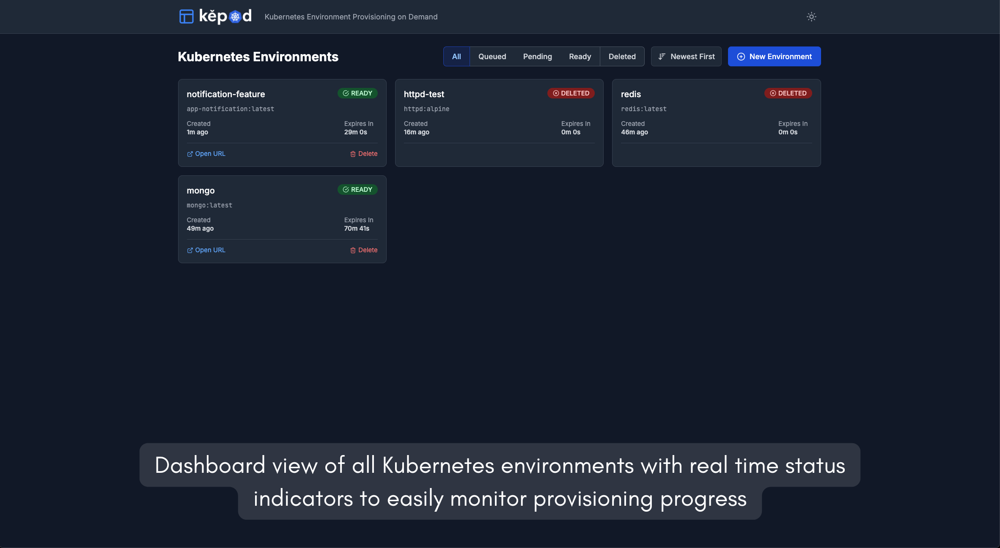
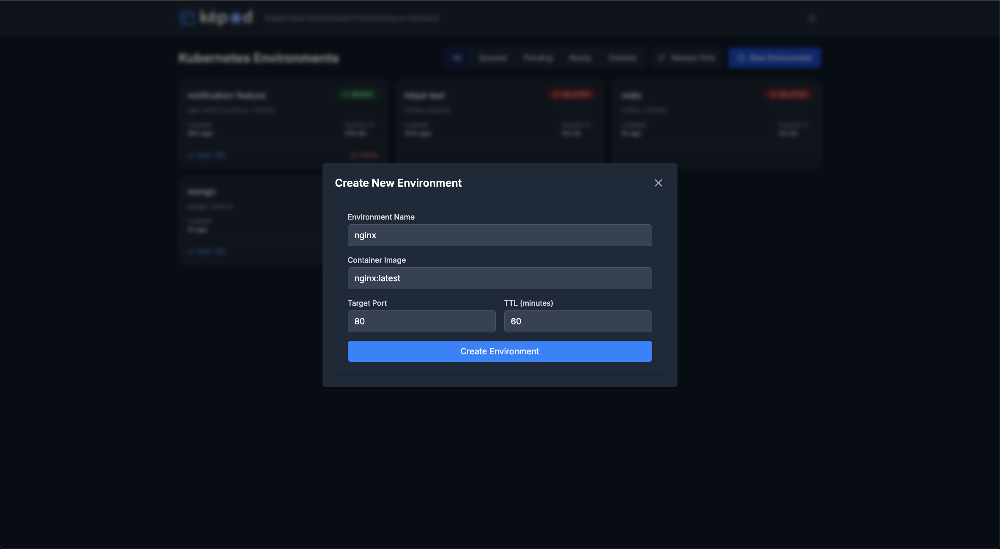
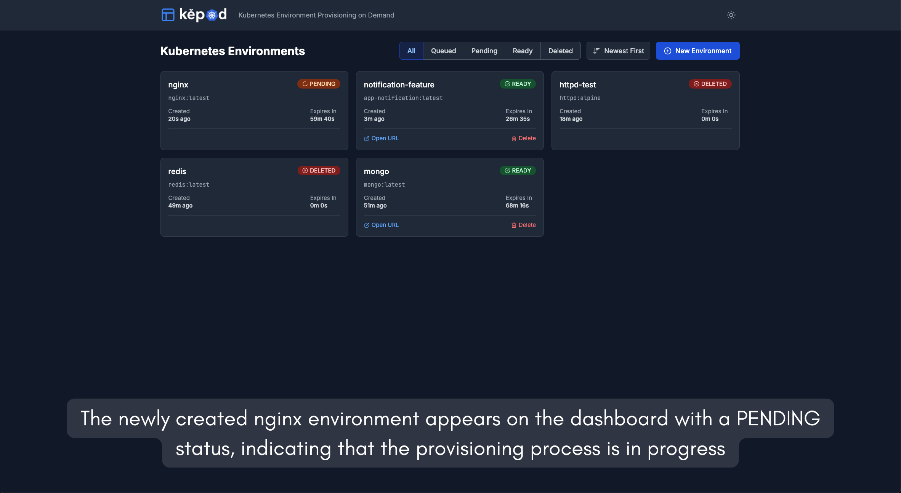
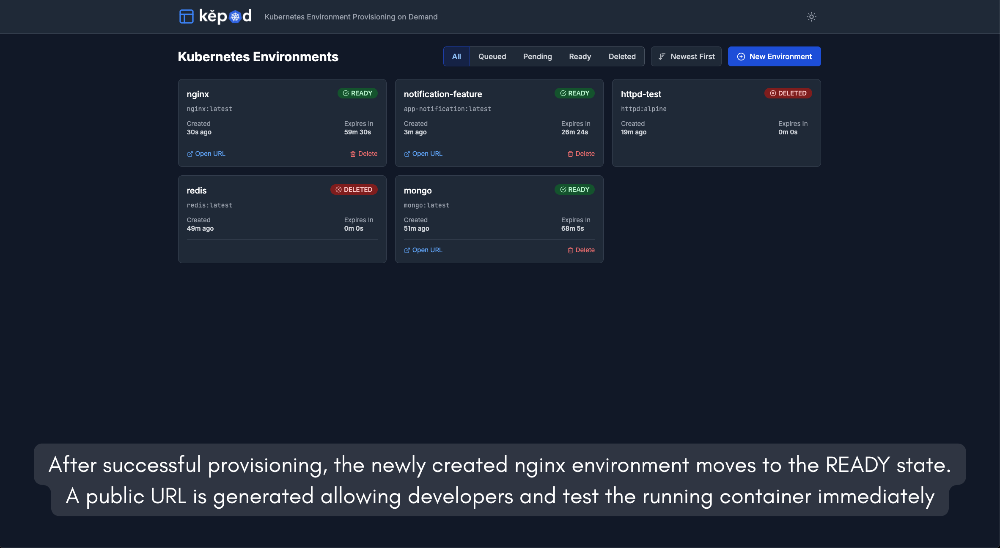
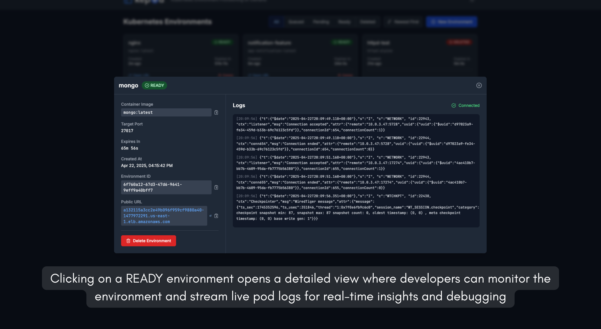

# KEPOD

**Kubernetes Environment Provisioning On Demand** — a dynamic environment provisioning system that allows developers to spin up ephemeral Kubernetes environments for testing and development, complete with real-time log monitoring and automatic TTL-based cleanup.

---

## 🧩 Features

- 🌀 **On-Demand Provisioning** — create environments with custom Docker images and TTL
- 📜 **Live Pod Logs** — real-time log streaming via WebSocket
- ⏱️ **TTL Expiry** — automatic deletion of environments after specified time
- 🌐 **Public URLs** — access services directly via Kubernetes LoadBalancer
- 🔐 **AWS-Backed Infrastructure** — using EKS, SQS, DynamoDB, ECR and S3
- 📈 **CloudWatch Dashboard** — monitoring environment health & metrics

---

## 🛠 Tech Stack

| Layer        | Tech Used                     |
|--------------|-------------------------------|
| Frontend     | React, Tailwind CSS           |
| Backend      | Node.js, Express.js           |
| Provisioner  | Node.js + Kubernetes Client   |
| Infra        | AWS EKS, SQS, DynamoDB, S3    |
| DevOps       | CloudFormation, ECR, kubectl  |
| Log Stream   | WebSocket + Kubernetes API    |

---

## 🚀 Getting Started

To run KEPOD end-to-end:

### 1. 📦 Create AWS Infrastructure

Provision the resources using the CloudFormation template:

```bash
aws cloudformation deploy \
  --template-file kepod-stack.yaml
  --stack-name kepod-stack \
  --region us-east-1 \
  --capabilities CAPABILITY_IAM
```

> This creates your VPC, EKS cluster, ECR repos, SQS queue, DynamoDB table, log groups and necessary IAM roles.

---

### 2. 🐳 Build & Push Docker Images

```bash
# Build KEPOD API image
docker build -t kepod-api:latest .

# Build Provisioner image
docker build -f Dockerfile.provisioner -t kepod-provisioner:latest .

# Tag and push to ECR
aws ecr get-login-password | docker login --username AWS --password-stdin <your-account-id>.dkr.ecr.us-east-1.amazonaws.com

docker tag kepod-api:latest <api-ecr-repo-uri>
docker push <api-ecr-repo-uri>

docker tag kepod-provisioner:latest <provisioner-ecr-repo-uri>
docker push <provisioner-ecr-repo-uri>
```

---

### 3. ☸️ Deploy to Kubernetes

Apply Kubernetes resources **in this order**:

```bash
# Set kube context to EKS cluster
aws eks update-kubeconfig --name kepod-cluster --region us-east-1

# 1. Namespace
kubectl apply -f k8s/kepod-api/namespace.yaml

# 2. Secret for ECR credentials
kubectl apply -f k8s/kepod-api/kepod-credentials-secret.yaml

# 3. KEPOD API
kubectl apply -f k8s/kepod-api/

# 4. RBAC for provisioner
kubectl apply -f k8s/rbac/

# 5. Provisioner deployment
kubectl apply -f k8s/provisioner/
```

---

### 4. 🌐 Get Public URL

```bash
kubectl get svc -n kepod
```

Copy the `EXTERNAL-IP` and use port `3000` for the API, `8080` for WebSocket.

---

## 📸 Walkthrough

### 0. System Architecture Overview
The KEPOD system provisions ephemeral Kubernetes environments on demand. The architecture leverages AWS EKS, SQS, DynamoDB and a WebSocket server to provide real-time log streaming and environment management.


### 1. Dashboard View
> Dashboard view of all Kubernetes environments with real time status indicators to easily monitor provisioning progress



---

### 2. Creating a New Environment
> Creating a new environment using nginx:latest image on port 80 with a TTL of 60 minutes



---

### 3. Environment Pending
> Once submitted, the newly created environment appears in the dashboard with a status of PENDING



---

### 4. Environment Ready
> When provisioning completes, the environment status updates to READY along with a publicly accessible URL



---

### 5. Environment Details & Logs
> Clicking on a READY environment opens a detailed view with real-time log streaming for monitoring and debugging



---

## 🔮 What’s Next for KEPOD?

Here’s a glimpse into upcoming features we’re planning to make KEPOD even more powerful and production-ready:

1. **External Cluster Provisioning**  
   → Allow developers to connect and deploy directly to their own Kubernetes clusters using temporary AWS credentials — making KEPOD adaptable for organizations with custom infrastructure.

2. **Notification System (Email Alerts)**  
   → Keep users in the loop with alerts for environment creation, expiry, deletion, and log status via Amazon SES or SendGrid. No more surprises — just clean, timely updates.

3. **API Rate Limiting & Usage Quotas**  
   → Ensure fair and secure usage with per-user rate limits and request quotas using intelligent middleware and request tracking.

---

## 📁 Project Structure

```
.
├── cloudformation/               # Infrastructure as Code (CloudFormation template)
│   └── kepod-stack.yaml          # Full stack definition including VPC, EKS, S3, DynamoDB, etc.
├── Dockerfile                    # For building the KEPOD API image
├── Dockerfile.provisioner        # For building the Provisioner service image
├── k8s/                          # Kubernetes deployment and service definitions
│   ├── kepod-api/
│   │   ├── deployment.yaml
│   │   ├── kepod-credentials-secret.yaml
│   │   ├── namespace.yaml
│   │   └── service.yaml
│   ├── provisioner/
│   │   ├── deployment.yaml
│   │   └── kepod-cleanup-cronjob.yaml
│   └── rbac/
│       ├── kepod-cluster-role.yaml
│       └── kepod-cluster-role-binding.yaml
├── src/                          # Source code
│   ├── assets/                   # Architecture & UI screenshots for documentation
│   │   ├── kepod-architecture.png
│   │   ├── 1.png to 5.png        # Sequential demo screenshots
│   ├── awsClients.ts             # AWS SDK clients for DynamoDB, SQS, etc.
│   ├── config/                   # Config management
│   │   └── config.ts
│   ├── controllers/              # Express route controllers
│   │   └── envController.ts
│   ├── middleware/               # Express middleware functions
│   │   ├── envExists.ts
│   │   ├── errorHandler.ts
│   │   ├── requestLogger.ts
│   │   └── validateEnvRequest.ts
│   ├── provisioner/              # Provisioner logic and background queue listener
│   │   ├── cleanupEnv.ts
│   │   ├── provisioner.ts
│   │   └── queueListener.ts
│   ├── routes/
│   │   └── envRoutes.ts          # Environment-related API routes
│   ├── types/                    # TypeScript types
│   │   ├── envTypes.ts
│   │   └── sqsMessageBodyTypes.ts
│   ├── utils/
│   │   ├── constants.ts
│   │   └── logger.ts
│   ├── websocket.ts              # WebSocket server for streaming pod logs
│   └── server.ts                 # Entry point for the Express server
├── tsconfig.json                 # TypeScript compiler configuration
└── package.json / lock.json      # Project dependencies
```

---

## 🤝 Contributing

We welcome contributions from the community! Here's how:

### 1. Fork & Clone
```bash
git clone https://github.com/NirbhayMeghpara/KEPOD.git
cd KEPOD
```

### 2. Create a Branch
```bash
git checkout -b feature/your-feature-name
```

### 3. Commit and Push
```bash
git commit -m "Add: your changes"
git push origin feature/your-feature-name
```

### 4. Make a PR

Submit your pull request on GitHub!

> Please include tests, follow consistent code style and update the documentation where applicable.

---

## 📃 License

This project is licensed under the [MIT License](LICENSE).